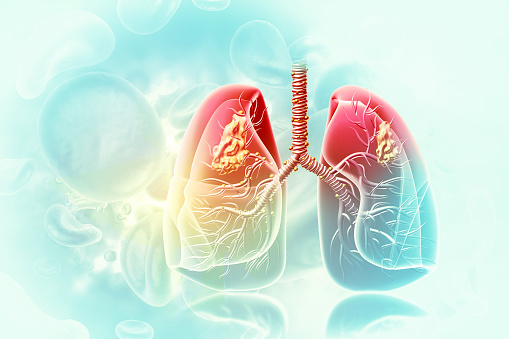

# Lung Cancer Analysis, Detection and Prediction

## What Is Lung Cancer?

    Cancer is a disease in which cells in the body grow out of control. When cancer starts in the lungs, it is called lung cancer.

    Lung cancer begins in the lungs and may spread to lymph nodes or other organs in the body, such as the brain. Cancer from other organs also may spread to the lungs. 

## Lung cancer symptoms may include—

    Coughing that gets worse or doesn’t go away.
    Chest pain.
    Shortness of breath.
    Wheezing.
    Coughing up blood.
    Feeling very tired all the time.
    Weight loss with no known cause., etc

## Who Should Be Screened?
    
    The U.S. Preventive Services Task Force (USPSTF) recommends yearly lung cancer screening with LDCT for people who—

    Have a 20 pack-year or more smoking history, and
    Smoke now or have quit within the past 15 years, and
    Are between 50 and 80 years old.

In this Dataset, we are going to study some common symptoms of Lung Cancer

# Dataset Source:

    Kaggle